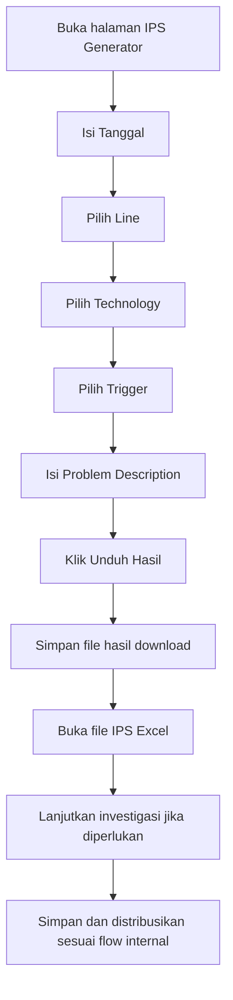

# IPS Generator

Project ini adalah aplikasi HTML client-side untuk membuat file IPS baru berdasarkan template Excel.

Pengguna dapat membuka halaman [ips.html](ips.html) secara langsung di browser atau lewat tombol `Buat IPS` pada aplikasi utama IPS Checker. Setelah field utama diisi, pengguna dapat langsung mengunduh hasil Excel yang sudah terisi tanpa perlu membuka atau mengedit template secara manual.

## Fitur Utama

- 100% client-side, tanpa backend
- Dapat berjalan offline
- Dapat dibuka langsung dari tombol `Buat IPS` pada aplikasi utama IPS Checker
- Template workbook default sudah di-embed ke dalam HTML
- Branding visual sudah terpasang langsung di HTML, termasuk logo header dan favicon tab browser berbentuk `IPS`
- Mengisi field form langsung ke cell Excel target
- Validasi visual untuk field wajib
- Tombol `Unduh hasil` hanya aktif jika field wajib valid
- Mendukung trigger checkbox `Quality`, `Delivery`, `Cost`, `Other`
- Menghasilkan Document ID unik otomatis ke cell `W6`
- Sequence Document ID disimpan di `localStorage` agar tetap berlanjut setelah browser di-refresh
- Nama file hasil unduhan dibuat otomatis dari nilai form
- Dibundle ke dalam build EXE IPS Checker melalui resource `assets/ips.html`

## File Project

- [ips.html](ips.html)
  Aplikasi utama. Berisi UI, styling, logic JavaScript, embedded workbook template, dan patching XML `.xlsx`.

- [2026_01_DD_IPS_SPM_LU21_EQUIPMENT_Problem Descript (template kosong IPS new).xlsx](2026_01_DD_IPS_SPM_LU21_EQUIPMENT_Problem%20Descript%20(template%20kosong%20IPS%20new).xlsx)
  Template workbook sumber yang dipakai untuk embed default workbook.

## Cara Menjalankan

Tidak perlu install dependency.

Pilihan akses:

1. Dari aplikasi utama IPS Checker, klik tombol `Buat IPS` di panel kiri.
2. Atau buka [ips.html](ips.html) langsung di browser.

Langkah penggunaan:

1. Tunggu workbook default selesai dimuat.
2. Isi field wajib:
   - Tanggal
   - Line
   - Technology
   - Problem Description
3. Pilih trigger jika diperlukan.
4. Klik `Unduh hasil`.

Setelah unduhan berhasil:

- workbook hasil akan terunduh otomatis
- field input form akan dikosongkan kembali
- sequence Document ID terakhir tetap tersimpan di browser

## Integrasi Dengan IPS Checker

Halaman generator ini dipakai sebagai bagian dari alur kerja aplikasi utama IPS Checker.

- Tombol `Buat IPS` di side panel aplikasi utama akan membuka [ips.html](ips.html).
- Pada build EXE, file ini ikut dibundle melalui [IPS Checker.spec](../IPS%20Checker.spec).
- User guide generator tersedia di `docs/ips-generator-user-guide.pdf` pada source project.
- Saat aplikasi utama dijalankan, PDF guide akan disalin ke folder runtime `data/docs/ips-generator-user-guide.pdf` di samping aplikasi.

## Alur Penggunaan Visual

Berikut alur penggunaan project ini dalam proses pembuatan dan pengisian form IPS Excel.



### Ringkasan Tahap

1. Persiapan

  Pengguna membuka halaman IPS Generator di browser, lalu memastikan form siap diisi.

2. Pengisian Form Utama

  Pengguna mengisi `Tanggal`, memilih `Line`, memilih `Technology`, mencentang `Trigger` yang relevan, lalu mengisi `Problem Description`.

3. Generate Dokumen

  Setelah field lengkap, pengguna menekan tombol `Unduh hasil`. Sistem akan membuat file Excel IPS dengan nama otomatis dan Document ID otomatis.

4. Verifikasi Hasil

  Pengguna menyimpan file hasil download, membuka file Excel, lalu memeriksa bahwa field yang terisi otomatis sudah sesuai.

5. Lanjutan Investigasi

  Jika diperlukan, pengguna melanjutkan pengisian bagian investigasi seperti evidence, why analysis, dan informasi tambahan sesuai prosedur IPS internal.

6. Finalisasi

  Setelah lengkap, file disimpan kembali dan didistribusikan ke pihak terkait sesuai alur kerja internal.

## Mapping Form ke Excel

Field utama yang diisi ke sheet `IPS V4.1`:

| Field | Cell | Keterangan |
| --- | --- | --- |
| Problem Description | `B19` | Otomatis diubah ke uppercase saat diproses |
| Tanggal | `P8` | Format `yyyy-mm-dd` |
| Line | `P6` | Dipilih dari dropdown |
| Technology | `Q14` | Dipilih dari dropdown |
| Document ID | `W6` | Dibuat otomatis saat download |

Trigger checkbox:

| Trigger | Cell | Nilai saat dicentang |
| --- | --- | --- |
| Quality | `C6` | `Q` |
| Delivery | `C8` | `D` |
| Cost | `C10` | `C` |
| Other | `C12` | `O` |

## Validasi

Field wajib menggunakan validasi visual:

- label diberi indikator `*`
- field kosong diberi border merah
- tombol download disabled sampai semua field wajib terisi
- status error juga ditampilkan pada area status

## Nama File Hasil

Nama file output dibentuk otomatis dari konfigurasi field.

Pola saat ini:

```text
{tanggal}_IPS_SPM_{line}_{technology}_{problem-description}.xlsx
```

Contoh:

```text
2026_01_15_IPS_SPM_LU21_PM100_BEARING NOISE.xlsx
```

## Document ID

Saat tombol `Unduh hasil` diklik, aplikasi juga mengisi cell `W6` dengan Document ID unik.

Pola saat ini:

```text
IPS-{linePrefix}-{technologyCode}-{YYYYMMDD}-{NNN}
```

Contoh:

```text
IPS-LU21-PM100-20260402-001
```

Catatan:

- `linePrefix` diambil dari bagian awal nilai `Line` sebelum tanda `-`
- `technologyCode` diambil dari pilihan `Technology`
- `NNN` adalah sequence yang disimpan di `localStorage` per tanggal

## Arsitektur Singkat

Konfigurasi utama disimpan di dalam [ips.html](ips.html):

- `FIELD_CONFIG`
  Menyimpan definisi field seperti label, target cell, tipe input, required, transform value, options dropdown, dan kontribusi ke nama file.

- `FILE_NAME_TEMPLATE`
  Menentukan urutan bagian nama file hasil unduhan.

- `UI_TEXT`
  Menyimpan status text dan string UI utama.

- `DOCUMENT_SEQUENCE_STORAGE_PREFIX`
  Menentukan prefix key `localStorage` untuk sequence Document ID.

Workbook diproses langsung di browser dengan membaca dan mengubah XML di dalam file `.xlsx`.

## Catatan Teknis

- Sheet target dikunci ke `IPS V4.1`
- Value type target dikunci ke `text`
- Workbook default di-load otomatis saat halaman dibuka
- Setelah download berhasil, field form dibersihkan kembali
- Logo header dan favicon tab browser di-embed langsung sebagai SVG inline
- Project ini tidak memerlukan koneksi internet untuk penggunaan normal

## Maintenance

Jika template Excel berubah:

1. Perbarui file template `.xlsx` di folder project.
2. Jika workbook default embedded ikut berubah, regenerate nilai `DEFAULT_WORKBOOK_BASE64` di [ips.html](ips.html).
3. Sesuaikan `FIELD_CONFIG` jika ada perubahan cell mapping, dropdown, atau aturan transform.

## Batasan

- Saat ini hanya mendukung satu template embedded default
- Target sheet masih fixed ke `IPS V4.1`
- Struktur form masih ditulis di HTML, meskipun label, placeholder, mapping, dan status text sudah dipusatkan ke konfigurasi JavaScript